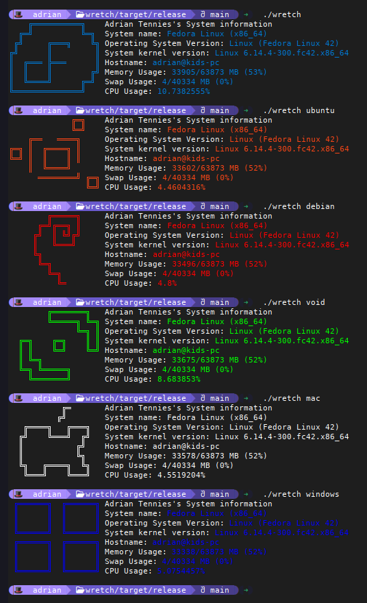

# wretch

A cli program that tells you info about your system! 
</img>

### Why in the hell does this exist
- We wanted to learn Rust cause it cool and speedy vroom

### Why is the code so bad and horrible
- We are starting out at this, feel free to contribute(if you're looking for something to contribute, check TODO.md, or if you think something's a good idea, put in in TODO.md through a pull request)

## Installation
Look at [INSTALLING](./INSTALL.md) on how to install wretch!

## Building and Compiling
   *Ignore the current paragraph if you already have rustup installed and working*
 - Download `rustup` from your package manager or at https://rustup.rs/ if it's not available.
> [!IMPORTANT]
   > Don't use rust from your package manager,
   > use rustup instead 
   > If you're on Windows or your distro doesn't have rustup in your package manager use https://rustup.rs/
 - run `rustup update stable` to get the latest toolchain

 - Clone Repo `git clone https://github.com/thesillyboi/wretch`
 - Run `cargo run --release` to run and build the best version of the project

#### To get added to PATH(not needing to define where the file is)
 -  (on Linux/Mac) run `sudo mv target/release/wretch /usr/local/bin/wretch` so you can call `wretch` without defining the path *(or move it to another folder in the PATH, such as /bin, /USR/BIN/, /SBIN/, /USR/SBIN, or you can put another folder in the PATH)*

 - (on Windows) to add to your `PATH` environment variable and run without defining the path everytime you want to run it
   - You can move it to any folder you want
     - I recommend making a folder for cli programs downloaded not from a package manager. like a folder in your documents.
   - Then open `Start` or the search and type something like `env` or `environment` and open `Edit the system environment variables` Control Panel Tool.
   - If you are not already make sure you're in the `Advanced` tab
   - At the bottom right of the window click `Environment Variables...`
   - In the `User variables for [your username]` section, scroll down until you see something named `Path` in the `Variable` column.
   - Either double click on that item or click on it once and then click `Edit...` in the User varuables section>>   - Now click on `New` on the window that popped up
   - Type in the path where your wretch lies, but leave out the wretch as this will include each .cmd, .bat, and .exe file to be in your path. (It also doesn't go into subdirectories)
     - Example: C:\Users\username\Documents\command-line-programs
     - Example: C:\Users\username\OneDrive\Documents\command-line-programs
   - Now click `OK`, then click `OK` again, and `OK` once more
   - Now, restart/close any shells/cmd/pwsh/powershells you have open and reopen them
   - Now try running `wretch`
   - Instead of doing the above two steps, you can restart your computer.

## Credits
All logos were created by Adrian Tennies, if you want your distro added/you think you can do it better, please keep the art style intact(trying to make it look like a neon sign), and put it in a pull request, and modify this to credit yourself for the logo

Thanks for checking this out!
  -Adrian Tennies & Cooper
